# BookStore Manager CLI

> Sistema de gerenciamento de livraria via terminal (CLI), desenvolvido utilizando **Node.js**, **TypeScript** e **PostgreSQL**, aplicando arquitetura em camadas, princípios de Programação Orientada a Objetos e boas práticas de desenvolvimento Back-End.


Projeto desenvolvido como atividade avaliativa do **Módulo 01 – Desenvolvedor Back-End**, tendo como objetivo consolidar conhecimentos em **TypeScript**, **PostgreSQL**, **SQL**, **Programação Orientada a Objetos**, **Arquitetura em Camadas**, **GitFlow** e **boas práticas de desenvolvimento**.

---

# Sumário

- [Sobre o Projeto](#sobre-o-projeto)
- [Objetivo](#objetivo)
- [Tecnologias Utilizadas](#tecnologias-utilizadas)
- [Pré-requisitos](#pré-requisitos)
- [Configuração do Banco de Dados](#configuração-do-banco-de-dados)
- [Instalação](#instalação)
- [Execução do Projeto](#execução-do-projeto)
- [Arquitetura do Projeto](#arquitetura-do-projeto)
- [Estrutura das Pastas](#estrutura-das-pastas)
- [Funcionalidades](#funcionalidades)
- [Exemplos de Execução](#exemplos-de-execução)
- [Estratégia de Branches](#estratégia-de-branches)
- [Integrantes](#integrante)
- [Quadro Kanban](#quadro-kanban)
- [Melhorias Futuras](#melhorias-futuras)
- [Considerações Finais](#considerações-finais)


---

# Sobre o Projeto

O **BookStore Manager CLI** é uma aplicação desenvolvida para gerenciamento de uma livraria por meio do terminal (CLI), permitindo realizar operações de cadastro, consulta, atualização e exclusão de informações relacionadas a:

- Autores
- Livros
- Clientes
- Empréstimos

Toda a persistência dos dados é realizada utilizando **PostgreSQL**, enquanto a aplicação foi construída em **TypeScript**, seguindo uma arquitetura em camadas para promover organização, reutilização de código e facilidade de manutenção.

Além das operações de CRUD, o projeto aplica conceitos importantes de desenvolvimento de software, como:

- Arquitetura em Camadas (Controller → Service → Repository);
- Programação Orientada a Objetos (POO);
- Tipagem forte com TypeScript;
- Validação de dados;
- Tratamento de exceções;
- Consultas SQL avançadas;
- Separação de responsabilidades;
- Versionamento utilizando GitFlow.

---

# Objetivo

Permitir o gerenciamento completo de uma livraria através de um menu interativo no terminal, contemplando cadastro de autores, livros, clientes, controle de empréstimos e devoluções, além de relatórios gerenciais extraídos diretamente do banco de dados.

Durante o desenvolvimento foram aplicados conceitos como:

- Node.js;
- TypeScript;
- Programação Orientada a Objetos;
- Interfaces;
- Async/Await;
- PostgreSQL;
- SQL;
- CRUD Completo;
- Relacionamentos entre tabelas;
- Consultas SQL com JOIN;
- CTE (Common Table Expressions);
- Subconsultas;
- Funções de agregação;
- Tratamento de erros;
- Git;
- GitHub;
- GitFlow;
- Organização de projetos.

---

# Tecnologias Utilizadas

| Tecnologia | Finalidade |
|------------|------------|
| **Node.js** | Ambiente de execução da aplicação |
| **TypeScript** | Linguagem principal do projeto |
| **PostgreSQL** | Banco de dados relacional |
| **pg** | Comunicação entre a aplicação e o PostgreSQL |
| **dotenv** | Gerenciamento de variáveis de ambiente |
| **Inquirer** | Construção dos menus interativos via terminal |
| **TSX** | Execução de arquivos TypeScript durante o desenvolvimento |
| **ESLint** | Análise estática e padronização do código |
| **Git** | Controle de versão |
| **GitHub** | Hospedagem e versionamento remoto dos códigos |

---
# Pré-requisitos

Antes de executar o projeto, certifique-se de possuir os seguintes requisitos instalados e configurados em sua máquina:

| Requisito | Descrição |
|-----------|-----------|
| **Node.js** | Versão LTS recomendada |
| **npm** | Gerenciador de pacotes do Node.js |
| **PostgreSQL** | Banco de dados utilizado pela aplicação |
| **Git** | Controle de versão |
| **VS Code** *(opcional)* | Editor recomendado para desenvolvimento |

Também é necessário possuir uma conta no **GitHub** para acesso ao repositório e utilização do fluxo de versionamento.

---

# Configuração do Banco de Dados

1. Abra o pgAdmin (ou o `psql`) e crie um banco de dados chamado `bookstore_manager_cli`:
```sql
    CREATE DATABASE bookstore_manager_cli;
```

2. Execute o script de criação das tabelas, localizado em `src/database/schema.sql`. No pgAdmin:
   - Conecte-se ao banco `bookstore_manager_cli`
   - Abra o **Query Tool** (Tools → Query Tool)
   - Cole o conteúdo do arquivo `src/database/schema.sql`
   - Execute (F5)

   Isso criará as 4 tabelas do sistema: `AUTORES`, `LIVROS`, `CLIENTES` e `EMPRESTIMOS`, já com as chaves primárias, chaves estrangeiras e constraints definidas.

Após a criação do banco, configure as credenciais de acesso através de um arquivo `.env` na raiz do projeto.

Exemplo:

```env
DB_HOST=localhost
DB_PORT=5432
DB_NAME=livrariasctec
DB_USER=postgres
DB_PASSWORD=sua_senha
```

> **Importante:** o arquivo `.env` não deve ser versionado no GitHub. Por esse motivo, ele já está incluído no arquivo `.gitignore`. Use o `.env.example` como modelo!

---

# Instalação

Clone o repositório:

```bash
git clone https://github.com/seu-usuario/livrariasctec.git
```

Instale todas as dependências:

```bash
npm install
```

---

# Execução do Projeto

Durante o desenvolvimento utilize:


| Script | Descrição |
|---------|-----------|
| `npm run dev` | Executa o projeto utilizando TSX. |
| `npm run watch` | Executa o projeto em modo observação (watch). |
| `npm run build` | Compila todos os arquivos TypeScript para JavaScript. |
| `npm start` | Executa a versão compilada localizada na pasta `dist`. |
| `npm run lint` | Analisa o código utilizando o ESLint. |

> **Observação:** durante o desenvolvimento, recomenda-se utilizar `npm run dev`, pois oferece uma execução baseadas em menus interativos.

---

# Arquitetura do Projeto

O projeto foi desenvolvido utilizando **Arquitetura em Camadas**, separando as responsabilidades da aplicação em diferentes níveis para facilitar manutenção, reutilização de código e escalabilidade.

Fluxo da aplicação:

```text
                Usuário
                    │
                    ▼
             Menu Interativo (CLI)
                    │
                    ▼
              Controllers
                    │
                    ▼
               Services
                    │
                    ▼
            Repositories
                    │
                    ▼
              PostgreSQL
```

<p align="center">
  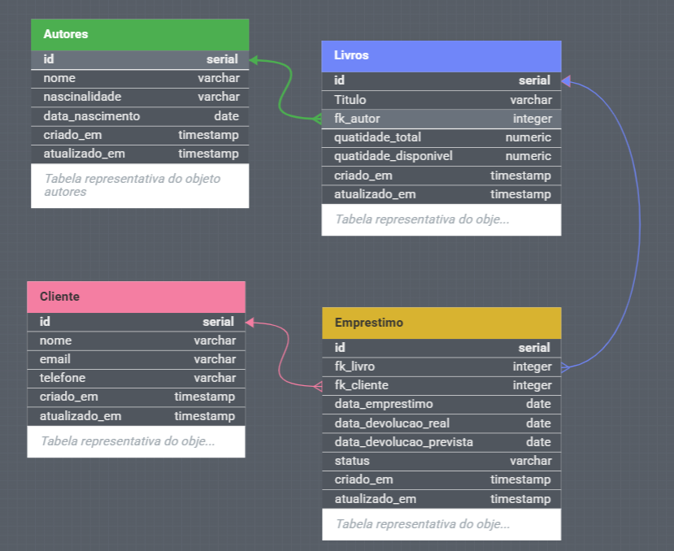
</p>

### Responsabilidades de cada camada

| Camada | Responsabilidade |
|---------|------------------|
| **Controller** | Responsável pela interação com o usuário e controle do fluxo da aplicação. |
| **Service** | Contém toda a lógica de negócio e validações do sistema. |
| **Repository** | Responsável pelo acesso ao banco de dados através de consultas SQL. |
| **Database** | Gerencia a conexão com o PostgreSQL. |
| **Models** | Representam as entidades e objetos de domínio da aplicação. |
| **Utils** | Reúne funções auxiliares utilizadas em diferentes partes do sistema. |

---
# Estrutura das Pastas

```text
livrariasctec/
├── src/
│   ├── controllers/          # Controla a interação com o usuário (CLI)
│   ├── services/             # Contém as regras de negócio da aplicação
│   ├── repositories/         # Responsável pelo acesso ao banco de dados
│   ├── models/               # Classes e interfaces das entidades
│   ├── database/             # Configuração da conexão com o PostgreSQL
│   ├── utils/                # Funções auxiliares reutilizáveis
│   └── main.ts               # Ponto de entrada da aplicação
│
├── sql/
│   └── schema.sql            # Script de criação do banco de dados
│
├── dist/                     # Arquivos JavaScript gerados pelo TypeScript
├── .env                      # Variáveis de ambiente (não versionado)
├── .gitignore                # Arquivos ignorados pelo Git
├── eslint.config.mjs          # Configuração do ESLint
├── package.json              # Dependências e scripts do projeto
├── package-lock.json         # Controle de versões das dependências
├── tsconfig.json             # Configuração do TypeScript
└── README.md                 # Documentação do projeto
```

---

# Funcionalidades

## Autores

- Cadastrar autores.
- Listar todos os autores cadastrados.
- Buscar autor por ID.
- Buscar autor por Nome
- Atualizar informações de um autor.
- Excluir autores.
- Validar dados antes da gravação.

---

## Livros

- Cadastrar livros.
- Listar todos os livros.
- Consultar livro por ID.
- Consultar livro por titulo
- Atualizar informações de livros.
- Excluir livros.
- Associar livros aos respectivos autores.
- Validar disponibilidade para empréstimo.

---

## Clientes

- Cadastrar clientes.
- Listar clientes cadastrados.
- Buscar cliente por ID.
- Buscar cliente por Nome
- Atualizar dados cadastrais.
- Excluir clientes.
- Validar CPF.
- Validar e-mail.
- Validar telefone.
- Validar data de nascimento.

---

## Empréstimos

- Registrar empréstimos de livros.
- Registrar devoluções.
- Controlar datas de empréstimo.
- Controlar datas previstas para devolução.
- Verificar disponibilidade dos livros.
- Impedir empréstimos duplicados do mesmo exemplar.
- Atualizar automaticamente a disponibilidade do livro.

---

## Relatórios

O sistema disponibiliza consultas SQL para geração de relatórios gerenciais.

Entre elas:

- Livros disponíveis para empréstimo.
- Livros atualmente emprestados.
- Livros agrupados por autor.
- Quantidade de empréstimos por livro.
- Clientes com empréstimos ativos.
- Livros mais emprestados.
- Total de livros cadastrados por autor.
- Autores com maior quantidade de livros.
- Clientes com maior número de empréstimos.
- Empréstimos acima da média.
- Consolidado de empréstimos por cliente.
- Ranking de livros mais populares.

---
## Tratamento de Erros
- Validação de dados inválidos (`ValidarErro`)
- Tratamento de registros não encontrados (`ErroNãoEncontrado`)
- Tratamento de falha de conexão com o banco

---
## Navegação
- Menus interativos utilizando Inquirer.
- Mensagens de sucesso, aviso e erro.
- Navegação simples através do terminal.
- Tratamento de entradas inválidas.
- Interface organizada para utilização em linha de comando.

---
# Exemplos de Execução

A seguir são apresentados alguns exemplos da execução da aplicação durante os testes realizados.

## Menu Principal

> *Menu principal e Submenus iterativos.*

<p align="center">
  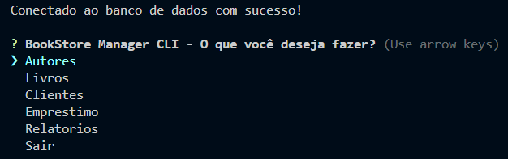
</p>

| Menu Autores | Menu Livros | Menu Clientes |
|:--------------:|:------------:|:--------------:|
| 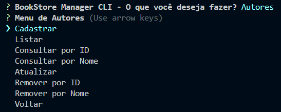 | 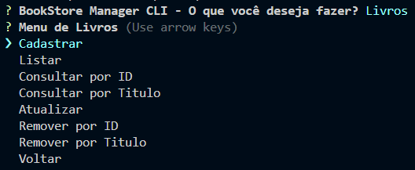 | 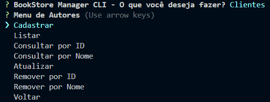 |

| Menu Emprestimos | Menu Relatórios |
|:---------:|:-------:|
| 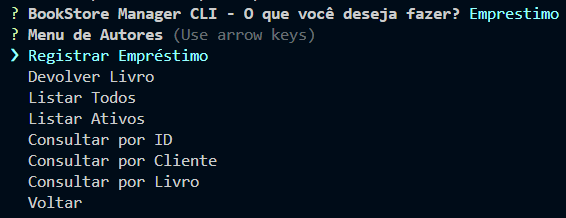 | 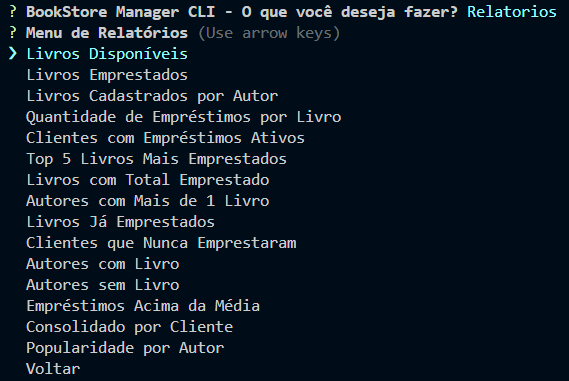 |

---

## Cadastro de Autor

> *Demonstranção do cadastro de um autor.*

<p align="center">
  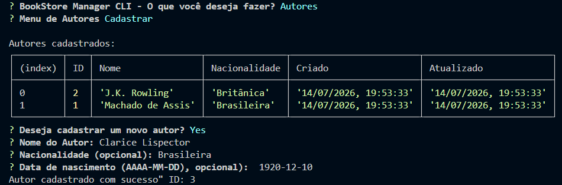
</p>

---

## Cadastro de Livro

> *Demonstrando do cadastro de um livro.*

<p align="center">
  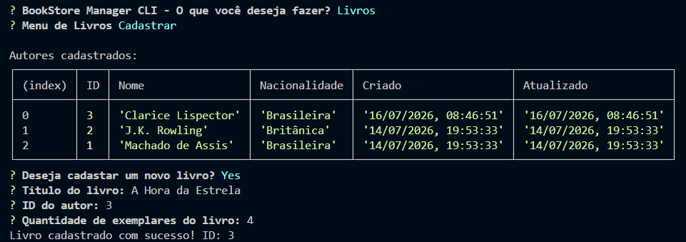
</p>

---

## Cadastro de Cliente

> *Demonstrando do cadastro de um cliente.*

<p align="center">
  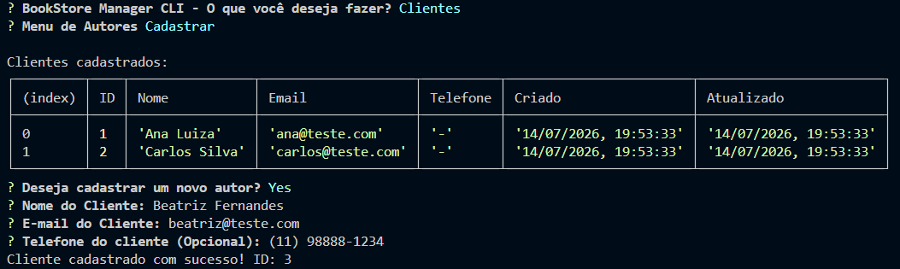
</p>

---

## Registro de Empréstimo

> *Demonstrando um empréstimo realizado com sucesso.*

<p align="center">
  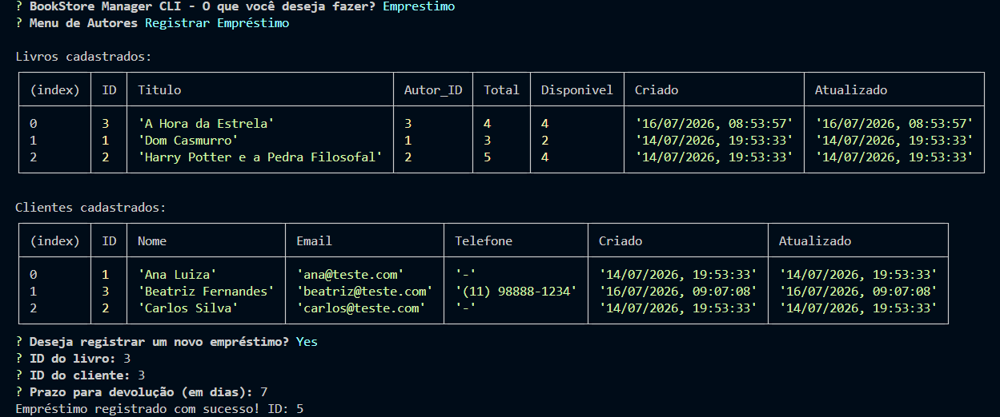
</p>

---

## Registro de Devolução

> *Demonstrando a devolução de um livro.*

<p align="center">
  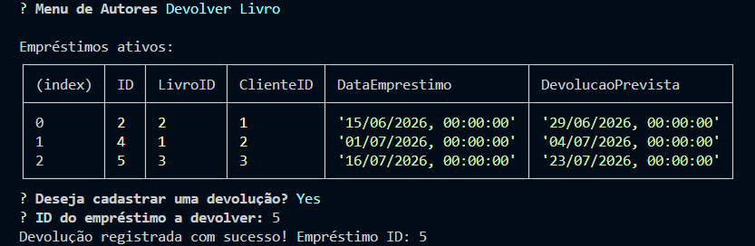
</p>

---

## Relatórios

> *Demonstração de alguns relatórios.*

| Cliente Emprestimos Ativos | Livros Disponiveis |
|:--------------:|:------------:|
| 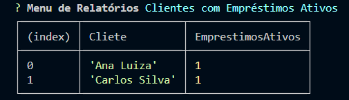 | 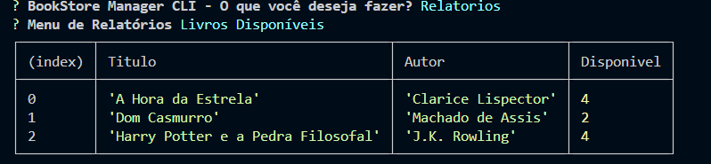

| Quantidade de Empréstimos por Livros | Livros Emprestados |
|:---------:|:-------:|
| 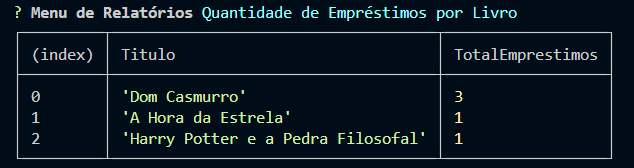 | 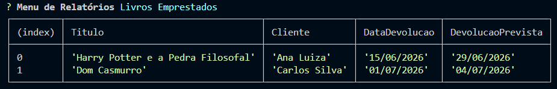 |

| Livros cadastrados por Autor
|:---------:|
| 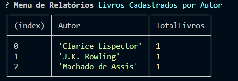 

---

## Tratamento de Erros

> *Demonstração de mensagens de erro geradas pela aplicação.*

| Nome inválido | E-mail inválido | E-mail duplicado |
|:--------------:|:------------:|:--------------:|
| 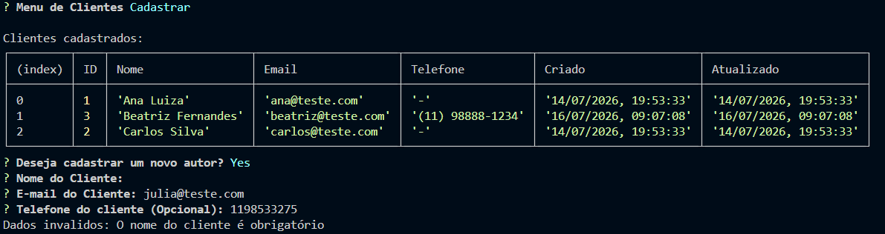 | 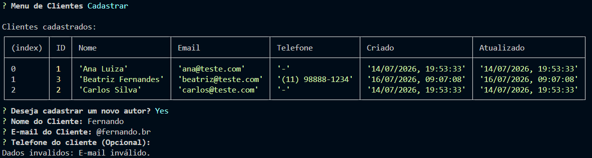 | 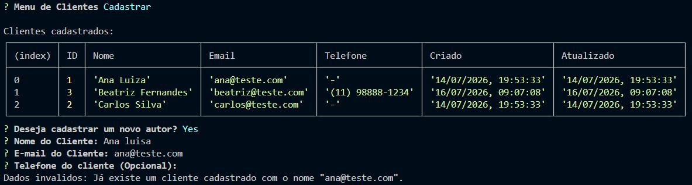 |


| Livro Não encontrado - ID | Livro Não encontrado - Nome |
|:---------:|:-------:|
| 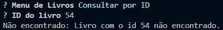 | 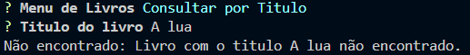 |

| Cliente Não encontrado - ID | Cliente Não encontrado - Nome|
|:--------------:|:------------:|
| 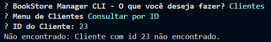 | 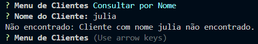 

---
| Empréstimo indisponível |
|:--------------:|
| 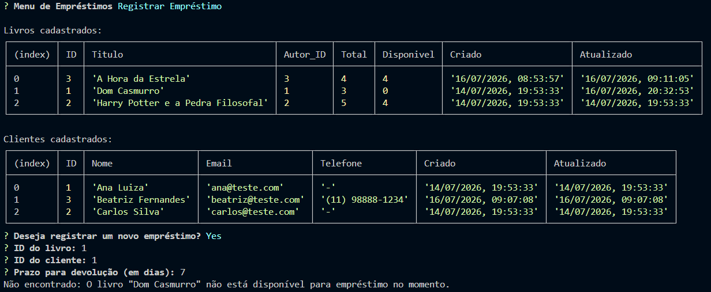 

| Empréstimo Não encontrado - ID | Empréstimo Não encontrado - ID Livro|
|:--------------:|:------------:|
| 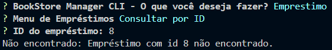 | 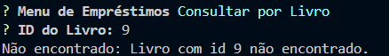 


---

# Estratégia de Branches

O projeto foi desenvolvido utilizando uma estratégia baseada no **GitFlow**, mantendo a separação entre ambiente principal, integração e desenvolvimento de funcionalidades.

| Branch | Finalidade |
|---------|------------|
| **main** | Contém a versão estável e final da aplicação. |
| **develop** | Responsável pela integração das funcionalidades desenvolvidas. |
| **feat/*** | Desenvolvimento de novas funcionalidades. |
| **fix/*** | Correções de bugs. |
| **refactor/*** | Reorganização ou melhoria do código sem mudar o comportamento. |
| **chore/*** | Tarefas de manutenção. |
| **style/*** | Formatação. |
| **docs/*** | Atualizações da documentação do projeto. |

Fluxo utilizado:

```text
main
 ▲
 │
develop
 ▲
 │
├── feat/autores
├── feat/livros
├── feat/clientes
├── feat/emprestimos
├── feat/relatorios
└── docs/readme
```

---
# Integrante

- Ana Luiza ([@aluizafullstack](https://github.com/aluizafullstack))

---

# Quadro Kanban

O gerenciamento das atividades foi realizado utilizando um quadro Kanban no Trello para acompanhamento das tarefas, organização das funcionalidades e controle do progresso do projeto.

**Link do quadro:**

> https://trello.com/invite/b/6a48631c8e2aa1de3633a916/ATTIac1b1221e58f3520fa12a2fcee5ba50b60CE024E/livraria

---

# Melhorias Futuras

- Relação N:N entre autores e livros (tabela intermediária `autores_livros`), permitindo livros escritos por mais de um autor
- Autenticação e controle de níveis de acesso (Administrador/Operador)
- Renovação automática de empréstimos e sistema de multas por atraso
- Reserva de livros indisponíveis
- Paginação e exportação de relatórios (PDF/Excel)
- Migração para API REST (Express.js) com interface Web
- Containerização com Docker

---

# Considerações Finais

Este projeto consolidou conhecimentos de Back-End com **Node.js**, **TypeScript** e **PostgreSQL**, aplicando POO, arquitetura em camadas, modelagem de banco e boas práticas — além de experiência prática com **Git/GitFlow** e organização via **Kanban - Trello**.